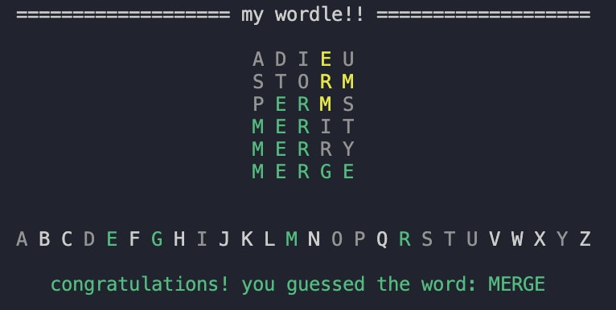

### VVORDLE: a python text-based wordle!
created by mandy wu as a part of the apcsp create task 

## installation
prerequisites: python 3.x, colorama library

to install colorama: type 
` pip3 install colorama ` into your terminal 

## how to play
simple run the script by typing: `python3 main.py` within the folder the files are stored in 

# sample gameplay: 

